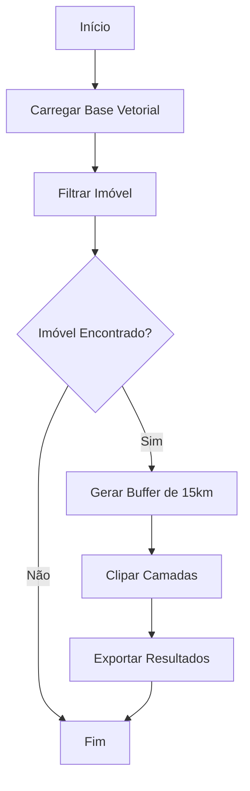

# Portfólio de análise de dados de Samuel Santos

Bem-vindo ao meu portfólio! Aqui estão alguns dos projetos que desenvolvi utilizando Python, Dash, Power BI, análise de dados e outras ferramentas. Sinta-se à vontade para explorar e me contatar caso queira discutir algum trabalho ou colaboração.

---

## Projetos em Destaque

### [Sistema de Certificação do Cadastro Ambiental Rural (CAR)](https://github.com/samuel-c-santos/sistema-certificacao-car)
- **Descrição**: Sistema desenvolvido para automatizar a emissão de certificados do Cadastro Ambiental Rural (CAR), garantindo eficiência e controle rigoroso das emissões realizadas. Implementado para a Secretaria de Estado de Meio Ambiente e Sustentabilidade (SEMAS/PA).
- **Principais Funcionalidades**:
  - Geração automatizada de certificados em PDF com números de série únicos.
  - Armazenamento no banco de dados para auditorias detalhadas.
  - Documentação completa de metadados de cada operação.
  - Controle de acesso e registro de ações realizadas por usuários.
- **Tecnologias**: Python, Flask, PostgreSQL, ReportLab
- **Demonstrações**:
  - [Tela Inicial e Login](https://player.vimeo.com/video/1035004919?h=805fa5024b)
  - [Geração por CPF/CNPJ](https://player.vimeo.com/video/1035004850?h=86aba52290)
  - [Geração por Lista](https://player.vimeo.com/video/1035004865?h=2d347da33e)

- **Captura de Tela**:
  

---

### [Painel de Incêndios Florestais na Austrália](https://github.com/samuel-c-santos/painel-incendios-australia)
- **Descrição**: Um painel interativo que explora dados históricos de incêndios florestais na Austrália. Permite visualizar a área estimada de incêndios e frequência mensal de ocorrências vegetativas por região.
- **Tecnologias**: Python, Dash, Plotly, Pandas
- **Link para Visualização**: [Acesse o painel](https://painel-incendios-australia.onrender.com)
- **Captura de Tela**:
  

---

### [Relatórios Power BI](https://github.com/samuel-c-santos/relatorios_bi)
Uma coleção de dashboards desenvolvidos com Power BI para análise e monitoramento estratégico em diversos contextos.

- **[Relatório de Iniciativas e Resultados da DIGEO/SEMAS-PA](https://app.powerbi.com/view?r=eyJrIjoiMzJhMTg4NzItMmI5Ny00YjQwLTgzN2UtOWQxMzU1M2JhNDk0IiwidCI6ImJiOWRkMWUwLTgzYmEtNGZmYS1hY2Q3LTQyNzJhZGY4ZGIyNSJ9)**:
  Integra dados de diferentes frentes de ação da DIGEO, como gestão de contratos, municipalização do CAR e mutirões de atendimento.
  

- **[Projeto Floresta+ Amazônia](https://app.powerbi.com/view?r=eyJrIjoiZGUwMWZmNjMtM2YwMC00OTVhLWE1ZTUtZTk5NWIxODYyNjUyIiwidCI6ImQ1MmMxYTcyLWUwNzEtNDhhNS04YTJhLTFjNDI5ZjMxYzE0MiJ9)**:
  Painel de monitoramento das ações do projeto Floresta+ Amazônia.
  

- **[Gestão de Contratos](https://app.powerbi.com/view?r=eyJrIjoiNGUzYTFkMTktNGM1Yy00M2VlLTg0YjItNjJmZGY4NGU2OTQyIiwidCI6ImJiOWRkMWUwLTgzYmEtNGZmYS1hY2Q3LTQyNzJhZGY4ZGIyNSJ9)**:
  Painel para acompanhar a execução de contratos fiscalizados pela DIGEO.
  

- **[Sobreposição de CAR em Áreas Protegidas](https://app.powerbi.com/view?r=eyJrIjoiNGQ4YzZmMWEtZTcwZC00MzY2LTk4MDctZjI1Y2I1ZTJiZTcyIiwidCI6ImJiOWRkMWUwLTgzYmEtNGZmYS1hY2Q3LTQyNzJhZGY4ZGIyNSJ9)**:
  Um dos 4 dashboards para monitorar sobreposições do CAR em terras indígenas, quilombos, unidades de conservação e assentamentos.
  

## Habilidades e Ferramentas
- **Linguagens**: Python, SQL
- **Ferramentas de Visualização**: Dash, Plotly, Power BI
- **Análise de Dados**: Pandas, NumPy
- **Geoprocessamento**: QGIS, Google Earth Engine

---

Aqui está um resumo para incluir no seu portfólio:

---

### Cenário Automatizado no QGIS para Análises Geoespaciais

### Resumo do Projeto
Este projeto automatiza a geração de cenários geoespaciais no QGIS, facilitando o trabalho da **Gerência de Tratamento Digital de Imagens e Suporte ao Monitoramento Espacial Ambiental (GTDI)**, da **Diretoria de Geotecnologias (DIGEO)**. Tradicionalmente, a GTDI monta cenários importando bases vetoriais extensas e organizando-as em grupos e subgrupos antes de realizar recortes com buffer de 15 km para análises detalhadas. 

Com este sistema, grande parte dessas etapas são automatizadas, permitindo que a equipe concentre esforços em tarefas analíticas e tomadas de decisão.

### Funcionalidades Principais
- **Cenário Automático de Vetores:** Importa, organiza e estrutura camadas geoespaciais em grupos e subgrupos no QGIS.
- **Clip Automático Base Local:** Filtra um imóvel específico, gera buffers de 15 km e recorta todas as camadas do projeto dentro desse limite.
- **Exportação e Organização Automatizada:** Camadas recortadas são exportadas e organizadas em uma estrutura clara e eficiente.

### Fluxograma do Sistema

### Captura de Tela

### Repositório
[Confira o projeto completo no GitHub](https://github.com/nidgeo-digeo-semas/cenario_automatizado_qgis)

---

### [Análise de Dados de Malária](https://github.com/samuel-c-santos/malaria-data-analysis)

- **Descrição**: Este projeto apresenta um pipeline completo para análise de dados de malária, desde a extração de dados em mais de 1000 arquivos PDF, passando pela transformação e consolidação, até a geração de mapas geoespaciais. Inclui mapas de risco, densidade de kernel e análises de autocorrelação espacial para suporte à tomada de decisão em saúde pública.
- **Principais Funcionalidades**:
  - Extração de dados de PDFs.
  - Consolidação e análise estatística dos dados.
  - Geração de mapas geoespaciais, como fluxo de casos importados e mapas de risco.
- **Tecnologias Utilizadas**: Python, pandas, geopandas, matplotlib, pdfplumber.
- **Repositório**: [Acesse o repositório no GitHub](https://github.com/samuel-c-santos/malaria-data-analysis)
- **Imagem**:
  

---

## Sobre Mim
Sou um profissional apaixonado por análise de dados e desenvolvimento de soluções baseadas em dados. Tenho experiência em geoprocessamento, regularização ambiental e ciência de dados.

- [LinkedIn](https://www.linkedin.com/in/samuelsantos-amb/)
- [Cartão Digital](https://dot.cards/samuelsantos)
- E-mail: samuelsantosambiental@gmail.com

---

## Certificações

  
  
  

### Certificado Profissional de IBM Data Science
- [Ver Certificação](https://www.coursera.org/account/accomplishments/professional-cert/S77137BIW3BB)

### Certificado Profissional de Google Business Intelligence
- [Ver Certificação](https://www.coursera.org/account/accomplishments/professional-cert/6O9UOEAOR8SC)

### Certificado Profissional de Google Data Analytics
- [Ver Certificação](https://www.coursera.org/account/accomplishments/professional-cert/UCL8PA52WE22)
